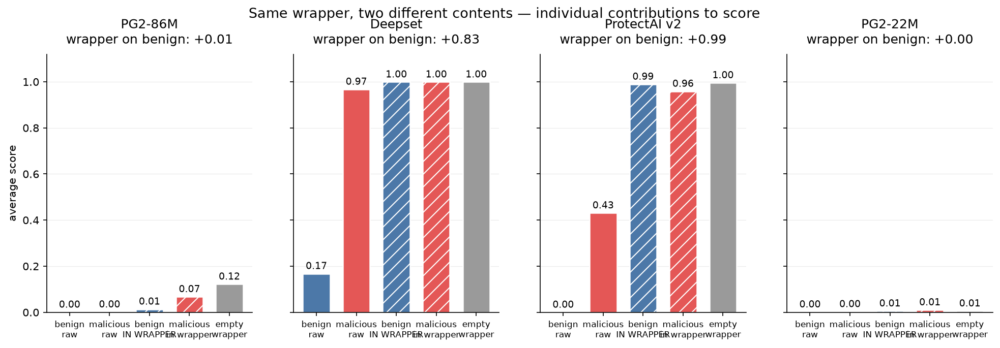
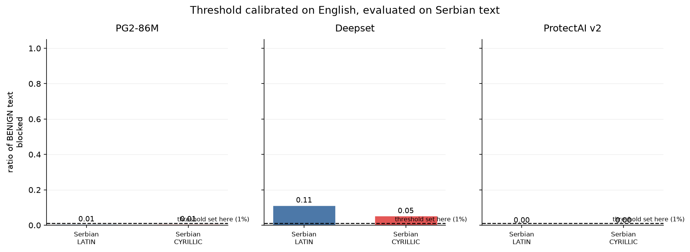
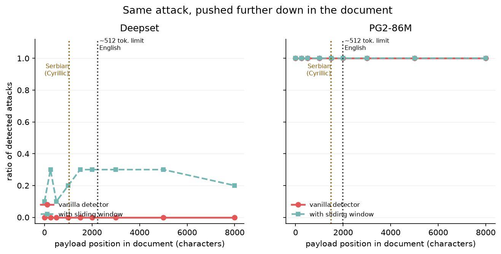
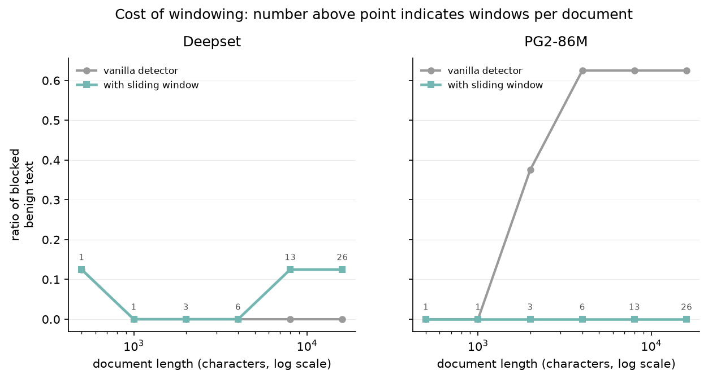
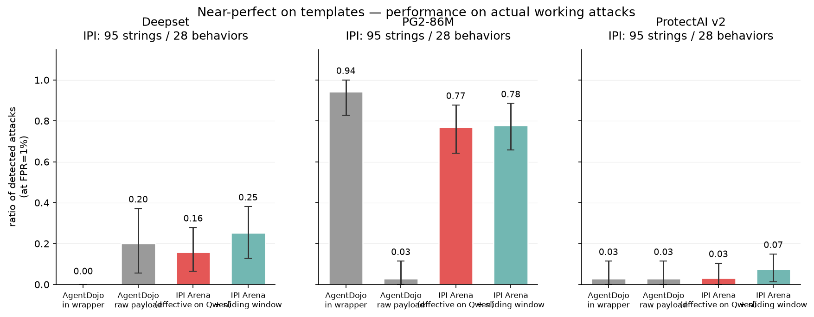
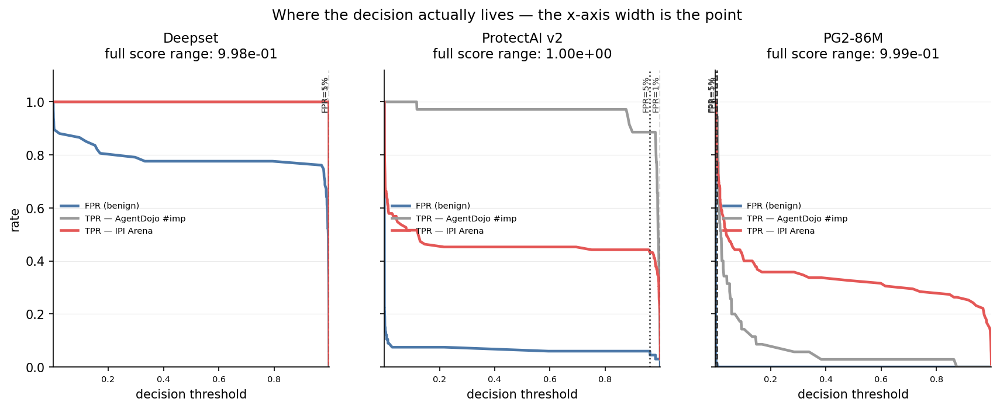

# What prompt-injection detectors actually respond to

An empirical audit of four prompt-injection guard classifiers. We set out to
evade them with Cyrillic homoglyphs, failed, and instead found three input properties that
drive their decisions far more than the content of the text does: the **format** wrapped
around it, the **language** it is written in, and the **position** of the payload inside a
long document.

PSIML 11 (Practical Seminar in Machine Learning), August 2026.

**Authors:** 

- [**Stefan Branković**](https://github.com/stefbrankovic)
- [**Katarina Bojović**](https://github.com/katarinnaaX)

**Mentors:** 

- **Kristina Nikolić** (ETH AI Center, SPY Lab)
- **Stefan Mojsilović** (Everseen)

---

## Quickstart

Every number in this README is in `results/tables/`, and every analysis step runs from cached
scores without calling a model:

```bash
conda env create -f environment.yml && conda activate psiml
export PYTHONPATH=src
python scripts/f2_analyze.py t1      # reproduces the analysis behind section 5
pytest -q                            # unit tests for transliteration and fertility
```

---

## Table of contents

1. [Headline results](#1-headline-results)
2. [Motivation](#2-motivation)
3. [Background and definitions](#3-background-and-definitions)
4. [Experimental setup](#4-experimental-setup)
5. [Track T1: format](#5-track-t1-format)
6. [Track T2: language and script](#6-track-t2-language-and-script)
7. [Track T3: position and the truncation boundary](#7-track-t3-position-and-the-truncation-boundary)
8. [Track T4: generalization to real attacks](#8-track-t4-generalization-to-real-attacks)
9. [A corrected detection policy, and what it costs](#9-a-corrected-detection-policy-and-what-it-costs)
10. [Discussion](#10-discussion)
11. [Limitations](#11-limitations)
12. [Future work](#12-future-work)
13. [Reproducing the results](#13-reproducing-the-results)
14. [Repository layout](#14-repository-layout)
15. [References](#15-references)

---

## 1. Headline results

| # | Finding | Evidence |
|---|---|---|
| 1 | A wrapper template containing **no instruction at all** scores like a real attack | 0.9989 on deepset, 0.9955 on ProtectAI v2 |
| 2 | The wrapper drives the score more than the goal inside it | Same 35 attack goals: TPR 0.94 wrapped, 0.03 raw (Prompt Guard 2 86M) |
| 3 | Thresholds do not transfer across language | 70.7% of benign Serbian in Latin script and 100% in Cyrillic blocked at a threshold costing 5% FPR on English (deepset) |
| 4 | The 512-token truncation boundary is predictable from the tokenizer and confirmed behaviourally | Predicted 1982 chars (Prompt Guard 2) and 2226 chars (deepset); measured score is identical to six decimals past that offset |
| 5 | The same blind spot is twice as close to the top in Serbian Cyrillic | 512 tokens hold 1025 Cyrillic chars vs 2226 English chars |
| 6 | Thresholds do not transfer across document length | 1% FPR calibration on short texts becomes 65% FPR on clean 4000-char documents (Prompt Guard 2, n=40) |
| 7 | Windowed scanning recovers detection, but only past the boundary | 0.05 to 0.98 TPR with the payload at 4000 chars; 0.94 vs 0.93 with the payload at the top |
| 8 | A minimal-budget homoglyph attack fails on average but works as denial of service | 3-character budget: d = +0.000 everywhere. But 45% of benign English emails can be pushed over deepset's threshold with a median of 18 substitutions |

---

## 2. Motivation

LLM agents now act rather than only answer. They read an inbox and draft replies, approve
payments, open documents and forward them on. When an agent reads external text, an attacker
who controls any part of that text can plant an instruction addressed to the agent rather
than to the user. The agent has no mechanism to separate the two: both arrive as tokens in
the same context window. This is **indirect prompt injection**.

The standard mitigation is a small guard classifier placed in front of the agent. It reads
each piece of external text and returns P(malicious); above a threshold the text is blocked
or sanitized. These guards ship as products with published claims.

Our original hypothesis was that Cyrillic homoglyphs would evade them. Serbian is written in
both Latin and Cyrillic script, so for us this is not an exotic trick but an everyday input
distribution. The hypothesis did not hold in the form we expected, and the reason it did not
hold turned out to be more informative than a successful evasion would have been.

---

## 3. Background and definitions

**Token and context window.** Models read tokens, not characters, roughly 3 to 4 characters
of English per token. All four detectors here have a 512-token input limit. Longer inputs are
truncated at inference: no error is raised, and the returned score reflects only the retained
prefix while looking like a score for the whole document. We verified this from the tokenizer
and model configuration and reproduced it in our scoring wrapper. Section 7 shows that this is
not an implementation detail but the largest exploitable property we found.

**Threshold, TPR, FPR.** A text is flagged when `score >= thr`. FPR is the fraction of
**benign** texts flagged, which is the cost to users. TPR is the fraction of **attacks**
flagged, which is the benefit. Lowering the threshold buys TPR at the price of FPR.

**Why we never compare at 0.5.** Raw scores are not comparable across models. deepset's entire
useful decision range lies between 0.99845 and 0.99899, a span of about 5e-4, while Prompt
Guard 2 operates around 0.006. Comparing two models at 0.5 compares two arbitrary points on
incomparable scales. Every number in this repository is therefore measured at a threshold
calibrated so that each detector spends the **same false-alarm budget** on the same benign
set, written `thr@FPR=1%` or `thr@FPR=5%`.

**Fertility and the effective window.** Fertility is tokens per character for a given
tokenizer. The effective window is `512 / fertility`, that is, how many **characters** fit
into the token budget. It differs by language, which is what makes the truncation blind spot
language-dependent.

**Cluster bootstrap.** The IPI Arena set has 95 attack strings covering only 28 distinct
target behaviours. Treating them as 95 independent samples would narrow confidence intervals
by roughly sqrt(95/28) = 1.8x, which is false precision. We resample whole behaviour clusters
with replacement and report `n_strings / n_clusters` everywhere.

**Bonferroni families.** Declared before looking at results: family L (language and script)
has m=1, family M (mixing budgets) has m=6, giving `alpha_eff = 0.0083` and `n_boot = 12000`
so that each interval tail is determined by at least 50 draws.

---

## 4. Experimental setup

### 4.1 Detectors

All four are used exactly as published. Nothing was trained or fine-tuned.

| key | model | params | note |
|---|---|---:|---|
| `promptguard2_86m` | meta-llama/Llama-Prompt-Guard-2-86M | 86M | multilingual, primary target |
| `promptguard2_22m` | meta-llama/Llama-Prompt-Guard-2-22M | 22M | smaller sibling |
| `protectai_v2` | protectai/deberta-v3-base-prompt-injection-v2 | 184M | English-only per its model card |
| `deepset` | deepset/deberta-v3-base-injection | 184M | weakest calibration in the set |

### 4.2 Data

| set | n | role |
|---|---:|---|
| AgentDojo injection tasks, `#imp` (wrapped) | 35 | attacks in the standard template |
| AgentDojo injection tasks, `#raw` (goal only) | 35 | same goals, wrapper removed |
| AgentDojo benign user goals | 24 | harmless requests for the 2x2 design |
| AgentDojo benign full texts | 67 | **calibration set** for all thresholds |
| IPI Arena | 95 strings / 28 behaviours | attacks that succeeded against a Qwen agent |
| Serbian corpus | 300 sentences, 150 per condition | benign text for the language axis |

### 4.3 Calibrated thresholds

Calibrated on the 67 benign full texts.

| detector | thr @ FPR=1% | thr @ FPR=5% |
|---|---:|---:|
| deepset | 0.998954 | 0.998690 |
| protectai_v2 | 0.999998 | 0.962360 |
| promptguard2_86m | 0.006012 | 0.001708 |

With n=67 the 1% threshold is determined by a single text and the 5% threshold by three.
This is a real limitation and is stated wherever those thresholds are used.

---

## 5. Track T1: format

### 5.1 Design

A 2x2 factorial: {malicious, benign} content x {raw, wrapped in the AgentDojo
`important message` template}, plus a fifth cell that is decisive, the wrapper with **empty**
content.

| cell | content | format |
|---|---|---|
| A | malicious | raw |
| B | malicious | wrapped |
| C | benign | raw |
| D | benign | wrapped |
| E | *nothing* | wrapped |

`W_ben = D - C` and `W_mal = B - A` are **paired**: the same string with one factor changed,
so the difference is attributable to the wrapper. `D_raw = A - C` and `D_imp = B - D` compare
**different text sets** that also differ in length, topic and vocabulary; they are reported
but never described as a clean content effect. `I = W_mal - W_ben` is the interaction.

### 5.2 Results

Mean P(malicious) per cell:

| detector | A mal-raw | B mal-wrapped | C ben-raw | D ben-wrapped | E empty-wrapped |
|---|---:|---:|---:|---:|---:|
| deepset | 0.9674 | 0.9989 | 0.1678 | **0.9989** | **0.9989** |
| protectai_v2 | 0.4308 | 0.9585 | 0.0000 | **0.9892** | **0.9955** |
| promptguard2_86m | 0.0011 | 0.0675 | 0.0004 | 0.0136 | **0.1220** |
| promptguard2_22m | 0.0025 | 0.0103 | 0.0012 | 0.0055 | 0.0055 |

Flag rates for Prompt Guard 2 86M, at its own FPR=1% threshold:

| cell | B mal-wrapped | D ben-wrapped | E empty-wrapped |
|---|---:|---:|---:|
| flag rate | 0.943 | **0.958** | **1.000** |

At a threshold tuned for 1% false positives, Prompt Guard flags 95.8% of *harmless* user goals
once they are wrapped, slightly more often than the malicious ones, and flags the empty
wrapper every time.

Paired decomposition with cluster-bootstrap intervals (alpha_eff = 0.0125, n_boot = 8000):

| detector | W_ben (paired) | W_mal (paired) | I (interaction) |
|---|---|---|---|
| deepset | **+0.831** [+0.631, +0.989] | +0.032 [+0.000, +0.100] | -0.800 [-0.962, -0.592] |
| protectai_v2 | **+0.989** [+0.986, +0.992] | +0.528 [+0.334, +0.720] | -0.462 [-0.651, -0.266] |
| promptguard2_86m | +0.013 [+0.010, +0.016] | +0.066 [+0.024, +0.146] | +0.053 [+0.011, +0.129] |
| promptguard2_22m | +0.004 [+0.004, +0.005] | +0.008 [+0.006, +0.010] | +0.003 [+0.002, +0.005] |



### 5.3 Reading

The strongly negative interaction on deepset and protectai is a **ceiling effect**:
malicious-raw already sits at 0.97 to 0.99, so the wrapper cannot push it much higher. We do
not present `I < 0` as evidence that the wrapper matters less for malicious text. Prompt Guard
has headroom and its interaction is positive.

Track T4 confirms the same conclusion from an independent direction: the same 35 attack goals
score TPR 0.94 wrapped and 0.03 raw. Two tracks, two metrics, one conclusion.

---

## 6. Track T2: language and script

### 6.1 Design

Two axes, deliberately separated.

**Axis L (language and script).** The same Serbian sentence in Latin and in Cyrillic via a
deterministic one-to-one transliteration. Same language, same meaning, same length. This is
the only comparison in the project with no confound at all.

**Axis M (mixing).** Homoglyph substitution at increasing budgets: 1, 2, 3, 5, 8, 13, 21
characters, then 25%, 50% and 100% of substitutable characters.

Thresholds are calibrated on **English** and then applied unchanged. The experiment is a test
of threshold transfer, not of raw accuracy.

### 6.2 The clean pair: false alarms on benign Serbian

| detector | @thr(FPR=1% on en) | @thr(FPR=5% on en) |
|---|---|---|
| deepset | 0.113 to 0.053, d = -0.060 (n.s.) | **0.707 to 1.000, d = +0.293 [+0.220, +0.367]** |
| protectai_v2 | 0.000 to 0.000 | 0.007 to 0.033, d = +0.027 [+0.007, +0.053] |
| promptguard2_86m | 0.007 to 0.007, d = 0.000 | 0.020 to 0.020, d = 0.000 |



At a threshold calibrated for 5% false positives on English, deepset blocks **70.7% of benign
Serbian in Latin script** and **100% in Cyrillic**. Language is the dominant term; script adds
the final 29 points. The effect is not architectural: deepset and protectai_v2 are both
`deberta-v3-base` and differ by two orders of magnitude here, and Prompt Guard 2 shows no
script effect at all. What differs is training data, not model class. None of this is
inferable from a model card. It only shows up by measuring in the target language.

### 6.3 The mixing axis moves in two opposite directions

FPR on benign text at thr(FPR=5% on English):

| detector | corpus | original | mix 3 chars | mix 100% |
|---|---|---:|---:|---:|
| promptguard2_86m | en | 0.045 | 0.045 | **0.597** |
| promptguard2_86m | sr_latn | 0.020 | 0.020 | 0.433 |
| protectai_v2 | sr_latn | 0.007 | 0.020 | **0.893** |
| protectai_v2 | sr_cyrl | 0.033 | 0.040 | **0.913** |
| deepset | sr_cyrl | 1.000 | 1.000 | **0.127** (direction reversed) |
| deepset | sr_latn | 0.707 | 0.853 | 0.920 |

The same perturbation is an **evasion** on deepset-Cyrillic, where the score falls below the
threshold, and a **denial of service** on protectai, where benign text becomes blocked. A
perturbation that moves the decision in opposite directions on two models is unlikely to be
carrying semantic information. The most plausible explanation is tokenization noise: the
substitution changes the subword sequence, and each model's decision boundary responds
differently to that shift.

### 6.4 The denial-of-service budget

For each benign text, `t2_dos.csv` searches for the **minimum number of homoglyph
substitutions** that pushes it above the detector's FPR=1% threshold.

| detector | corpus and direction | n | solvable | median budget | minimum seen |
|---|---|---:|---:|---:|---:|
| deepset | en, Latin to Cyrillic | 67 | **45%** | 18.5 chars | 1 char |
| promptguard2_86m | en, Latin to Cyrillic | 67 | **37%** | 21 chars | 2 chars |
| protectai_v2 | en, Latin to Cyrillic | 67 | 10% | 21 chars | 1 char |
| deepset | sr_cyrl, Cyrillic to Latin | 150 | 11% | 1 char | 0 |
| promptguard2_86m | sr_cyrl, Cyrillic to Latin | 150 | 5% | 30 chars | 0 |
| protectai_v2 | sr_cyrl, Cyrillic to Latin | 150 | 0% | not solvable | not solvable |

This is the availability side of the story and it partially rescues the original hypothesis.
The 3-character budget fails **on average**, but for roughly four in ten benign English emails
there exists a budget of about 20 characters, and for some a single character, that flips the
detector into "attack". An attacker who wants to make an inbox filter unusable does not need
to evade it. They need to trip it on the victim's own mail.

---

## 7. Track T3: position and the truncation boundary

### 7.1 Effective window in characters

`512 / fertility`, measured per detector tokenizer:

| detector | English | Serbian Latin | Serbian Cyrillic |
|---|---:|---:|---:|
| deepset / protectai_v2 | **2226** | 1369 | **1025** |
| promptguard2_86m | **1982** | 1532 | 1485 |

Same model, same 512-token limit, and it reads 2226 characters of English but only 1025 of
Serbian Cyrillic. The blind spot is not language-neutral: for a Serbian user it sits 2.2x
closer to the top of the document.

### 7.2 The freeze point

Design: one payload inserted into a benign carrier at increasing offsets (0, 250, 500, 1000,
1500, 2000, 3000, 5000, 8000), document length fixed at about 16000 characters.

| detector | predicted boundary | last offset that still moves the score | first offset where the score is identical to 6 decimals and stays identical |
|---|---:|---:|---:|
| promptguard2_86m | 1982 chars | 1500 | **2000** (9 of 10 payloads) |
| deepset | 2226 chars | 2000 | **3000** (10 of 10) |
| protectai_v2 | 2226 chars | 2000 | **3000** (10 of 10) |

Example, `workspace__injection_task_0#imp` on promptguard2_86m:

| offset | 0 | 250 | 500 | 1000 | 1500 | 2000 | 3000 | 5000 | 8000 |
|---|---:|---:|---:|---:|---:|---:|---:|---:|---:|
| score | 0.0302 | 0.0684 | 0.1073 | 0.0508 | 0.9583 | 0.009485 | 0.009485 | 0.009485 | 0.009485 |



The score does not decay past the boundary. It **freezes**, at exactly the value the carrier
alone would receive, because the model is scoring the carrier and the payload does not exist
for it. Two independent methods that share no code, tokenizer arithmetic and behavioural
measurement, land on the same boundary. That is what makes this a mechanism rather than a
correlation, and it is the result we would defend most strongly.

### 7.3 Thresholds do not transfer across document length

No attack is present in any of these documents. This is pure false-positive rate, n=40 clean
carriers per length.

| detector and mode | 500 | 1000 | 2000 | 4000 | 8000 | 16000 |
|---|---:|---:|---:|---:|---:|---:|
| promptguard2_86m, naive | 0.000 | 0.000 | **0.325** | **0.650** | **0.650** | **0.650** |
| promptguard2_86m, chunked | 0.000 | 0.000 | 0.000 | 0.000 | 0.050 | 0.075 |
| deepset, naive | 0.050 | 0.000 | 0.000 | 0.000 | 0.000 | 0.000 |
| deepset, chunked | 0.050 | 0.000 | 0.000 | **0.050** | **0.075** | **0.150** |
| protectai_v2, naive | 0.000 | 0.000 | 0.000 | 0.000 | 0.000 | 0.000 |
| protectai_v2, chunked | 0.000 | 0.000 | 0.000 | 0.000 | 0.000 | 0.000 |
| windows per document | 1 | 1 | 3 | 6 | 13 | 26 |



Two distinct failure modes, and the sliding window swaps one for the other.

- **Distribution shift** (Prompt Guard): the threshold was calibrated on short texts, a long
  document is out of that distribution and scores higher regardless of content, and chunking
  restores the input length the threshold was calibrated for.
- **Multiple comparisons** (deepset): naive FPR is already 0, but taking the maximum over 26
  windows gives 26 chances to fire, and FPR climbs to 0.150.

The correct statement is therefore that the sliding window trades a distribution-shift error
for a multiple-comparisons error, and which one dominates is a property of the detector rather
than of the technique. We do not claim that the window costs FPR: that is true for exactly one
of the three detectors here.

### 7.4 A trap in our own summary table

`results/tables/t3_summary.csv` reports `tpr_naive_off8000 = 1.00` for Prompt Guard. That is
not detection. At that document length the detector fires on 65% of clean carriers, and the
payload is past the truncation boundary and contributes nothing. Any TPR measured at a
document length where FPR is 0.65 is uninterpretable. This is exactly why section 9 re-measures
with matched document lengths.

### 7.5 protectai_v2 has no usable operating point at FPR=1%

`thr = 0.999998` gives TPR 0.00 at every offset and FPR 0.00 at every length, and every
aggregation rate is zero. The detector simply never fires. We report this as "no usable
operating point at 1% FPR on this benign set" and make all protectai claims at FPR=5%. The
zeros are not robustness.

---

## 8. Track T4: generalization to real attacks

AgentDojo is a template: 35 goals, one wrapper, none of them ever run against an agent. IPI
Arena is a set of strings that actually succeeded against a Qwen agent in a competition.

At FPR = 1%:

| detector | agentdojo `#imp` | agentdojo `#raw` | IPI naive | IPI chunked | AUC (IPI) |
|---|---|---|---|---|---|
| deepset | 0.00 [0.00, 0.00] | 0.20 [0.06, 0.37] | 0.16 [0.07, 0.28] | 0.25 [0.13, 0.38] | 0.957 |
| promptguard2_86m | **0.94** [0.83, 1.00] | **0.03** [0.00, 0.11] | 0.77 [0.64, 0.88] | 0.78 [0.66, 0.89] | 0.985 |
| protectai_v2 | 0.03 [0.00, 0.11] | 0.03 [0.00, 0.11] | 0.03 [0.00, 0.10] | 0.07 [0.01, 0.15] | 0.886 |

At FPR = 5%:

| detector | agentdojo `#imp` | agentdojo `#raw` | IPI naive | IPI chunked |
|---|---|---|---|---|
| deepset | 1.00 | 0.69 | 0.71 [0.56, 0.82] | **0.92** [0.84, 0.97] |
| promptguard2_86m | 1.00 | 0.09 | 0.95 | 0.95 |
| protectai_v2 | 0.89 | 0.34 | 0.43 [0.25, 0.61] | 0.54 [0.35, 0.69] |

All IPI rows are n = 95 strings / 28 behaviours.



Note deepset's flip: TPR 0.00 at FPR=1% and 1.00 at FPR=5% on the *same* attack set, for a
threshold difference of 0.000264. The entire decision surface lives in the fourth decimal
place. Plotted as an operating characteristic this is undeniable:



TPR by attack length on IPI Arena:

| detector | 0-500 (n=13) | 500-1500 (n=50) | 1500-4000 (n=22) | 4000+ (n=10) |
|---|---:|---:|---:|---:|
| deepset naive | 0.538 | 0.160 | **0.000** | **0.000** |
| deepset chunked | 0.538 | 0.200 | 0.273 | 0.100 |
| promptguard2_86m naive | 0.231 | 0.760 | **1.000** | **1.000** |
| protectai_v2 naive | 0.231 | 0.000 | 0.000 | 0.000 |

The two detectors depend on length in opposite directions. deepset loses long attacks, which is
consistent with truncation, and chunking partially recovers them. Prompt Guard's TPR rises to
1.00 on long attacks, but section 7.3 shows it also fires on 65% of clean documents of that
length, so a large part of that apparent detection is the same length bias. Both numbers have
to be presented together or the claim is misleading.

**Selection bias.** IPI Arena strings were collected because they succeeded against one agent.
That is selection on the outcome. The defensible claim is "generalization drops on the IPI
Arena distribution", not "detectors fail on real attacks".

---

## 9. A corrected detection policy, and what it costs

Sections 5 to 8 describe how the detectors fail. This section assembles the three fixes into
one procedure and measures what it recovers and what it does not.

### 9.1 Design

Both sides of the comparison have the **same document length**. Each IPI Arena attack is
embedded into a 16000-character benign carrier, exactly like the clean carriers used as the
negative set, so that both sides produce the same number of windows. Every rule gets its **own
threshold**, calibrated on one half of the carriers to the same 5% false-alarm budget and
measured on the held-out half. Without per-rule calibration a stricter rule would appear to win
on FPR simply because it fires less often.

Rules compared: one pass over the whole document; sliding window with `size=1200, stride=600`
and max aggregation; the same with corrected head coverage, that is one extra window
`text[:stride]` so that every character sits in exactly two windows; and the same with
`count>=2` aggregation.

### 9.2 Results, Prompt Guard 2 86M

| payload position | one pass | sliding window |
|---|---:|---:|
| at the top of the document | 0.937 | 0.926 |
| past the truncation boundary (offset 4000) | 0.053 | **0.979** [0.947, 1.000] |

With the payload past the boundary, a single pass catches 5%, which is the false-alarm floor,
meaning it is catching nothing. The sliding window catches 98%. With the payload at the top,
where one pass can already read it, the window adds nothing.

That control is what makes the claim defensible. The gain is not chunking as a technique. It is
exactly the region a single pass cannot read.

deepset recovers far less, from 0.042 to 0.179 at the same operating point, because the window
restores **visibility** but cannot fix a model whose entire decision range is 5e-4 wide.
Separability and visibility are different problems.

### 9.3 What the policy does not fix

- **Language.** No aggregation rule touches the 70.7% false-alarm rate on benign Serbian.
  Windows chop text; they do not recalibrate a threshold.
- **Format.** An empty wrapper still scores 0.9989. Chunking changes how much text the model
  sees; it does not remove the format effect.
- **Cost.** At the 1200/600 setting, a 16000-character document requires about 27 inference
  calls instead of one.
- **Scope.** We measure the guard classifier. We never test whether an agent would have
  executed the instruction, so every detection number here is a ceiling on protection rather
  than evidence of prevention.

### 9.4 A caveat we state ourselves

Under held-out calibration the realized FPR is no longer pinned at exactly 5%: on the 20
held-out carriers the one-pass rule ran at 0.00 and the window at 0.10. The window is therefore
paying something, although the effect size, 0.05 to 0.98, is far outside that difference. The
`count>=2` rule reached 0.20 FPR on the held-out half and is therefore not comparable at all,
so we exclude it from the headline claim.

---

## 10. Discussion

**What holds without an agent.** The false-positive results need no further assumption. A
filter that blocks 70.7% of harmless Serbian has already caused the harm: the legitimate
message is blocked or rejected. The same applies to 65% on clean long documents. These are end
outcomes, not proxies for one.

**What does not.** A filter that misses an attack is not an agent that obeyed it. Every
detection number in this repository bounds how much protection a guard can provide; none of
them establishes that a compromise occurred or was prevented. The 0.05 to 0.98 result should be
read as a blind spot closing, not as attacks stopped.

**On the negative result.** The homoglyph hypothesis failed in the form we proposed it. Asking
why produced two things a successful evasion would not have: a boundary we could predict from
the tokenizer before measuring it, and a class of failures that lands on ordinary users rather
than on attackers.

**On the arms race.** Guards are trained on attacks that already exist, so defenses answer last
year's question by construction. Ours is no exception, which is where section 12 begins.

---

## 11. Limitations

1. We measure detector scores, **not** end-to-end agent compromise. Nothing here claims an
   attack would have succeeded.
2. The FPR=1% threshold is determined by **one** of 67 benign texts, and the 5% threshold by
   three.
3. IPI Arena is selected on success against one agent, which is selection on the outcome.
4. T1's interaction term is contaminated by a **ceiling effect** on deepset and protectai.
5. T3 uses 10 payloads and one carrier construction. The carriers are synthetic, assembled by
   concatenating benign texts, and are not real inbox threads.
6. Section 9 measures one insertion offset past the boundary and one at the top. Sweeping the
   offset would be better.
7. protectai_v2 has no usable operating point at FPR=1% on this benign set.
8. We do not compare against published Prompt Guard numbers: different benign set, different
   threshold, incomparable.

---

## 12. Future work

**The attacker's next move: split payload.** Our own window only helps while the entire
instruction fits inside one window. Splitting it across two window boundaries makes each window
read as harmless while the assembled document still reads as an order to the agent. Our fix
creates this attack, and it is testable immediately with the existing code.

**A blind-spot atlas.** The truncation boundary falls out of the tokenizer alone: no attack
data, no GPU, no model call. One table of detector x language would tell a practitioner where
each model goes blind before deployment. The prediction that follows from section 7.1 is that
the worse a tokenizer fits a language, the closer to the top the blind spot sits. Serbian
Cyrillic is already 2.2x worse than English, and there are far worse cases than Serbian.

**Length-matched and language-matched calibration.** Calibrate the threshold per document
length and per language, then re-measure every effect in this repository. How much of each
effect survives correct calibration is currently unknown, and it is the largest remaining
confound in T3 and T4.

**Stop reading the text.** Probe the agent's own internal state rather than the incoming
string, where tokenization and truncation do not exist, and make the metric a compromised
action rather than a score. That is the gap this project sits next to and did not close.

---

## 13. Reproducing the results

### 13.1 Environment

```bash
conda env create -f environment.yml
conda activate psiml
export PYTHONPATH=src            # Windows: set PYTHONPATH=src
```

Detector scores are cached on disk by SHA1 of the input string, so re-running an analysis is
free after the first pass. The cache lives in `.cache/scores/` and is not committed; the
per-sample scores needed to reproduce every table are in `results/raw/`.

### 13.2 Full pipeline

```bash
# data preparation
python scripts/f2_data.py agentdojo-benign
python scripts/f2_data.py benign-goals
python scripts/f2_data.py sr-corpus --n 300

# measurement tracks (the only steps that call the models)
python scripts/f2_t1_envelope.py --detectors deepset protectai_v2 promptguard2_86m promptguard2_22m
python scripts/f2_t2_script.py   --detectors promptguard2_86m deepset protectai_v2 --limit 150
python scripts/f2_t3_window.py   --detectors deepset promptguard2_86m protectai_v2 --n-carriers 40
python scripts/f2_t4_external.py --detectors deepset promptguard2_86m protectai_v2

# corrected detection policy (section 9)
python scripts/f2_defense.py --detectors deepset promptguard2_86m --embed 4000 --holdout
python scripts/f2_defense.py --detectors deepset promptguard2_86m --embed 0    --holdout

# analysis, no model calls at all
python scripts/f2_analyze.py t1
python scripts/f2_analyze.py t2
python scripts/f2_analyze.py t3
python scripts/f2_analyze.py t4

# figures
python scripts/f2_figs.py
python scripts/f2_fig9.py
```

### 13.3 Tests

```bash
pytest -q
```

---

## 14. Repository layout

```
scripts/
  f2_data.py            dataset preparation
  f2_t1_envelope.py     T1, the 2x2 format design
  f2_t2_script.py       T2, language, script and mixing budgets
  f2_t3_window.py       T3, payload position, effective window, cost of chunking
  f2_t4_external.py     T4, AgentDojo vs IPI Arena
  f2_defense.py         section 9, corrected detection policy and its control
  f2_analyze.py         corrected analysis: calibration, bootstrap, multiple comparisons
  f2_figs.py            figures 1 to 7
  f2_fig9.py            operating characteristics
  f2_demo.py            worked examples

src/psiml/
  scoring.py            Scorer with disk cache, windows(), score_chunked(), score_chunked_detail()
  metrics.py            threshold_at_fpr, rate_above, AUC with average ranks, cluster bootstrap
  data.py               dataset loading
  translit.py           deterministic Cyrillic and Latin transliteration
  analysis/fertility.py tokenizer fertility and effective window in characters
  attack/homoglyphs.py  homoglyph mapping
  attack/mixing.py      substitution budgets

results/
  tables/               every number in this README, as CSV
  figures/              every figure in this README
  raw/                  per-sample and per-window scores in JSONL

docs/                   working notes, decision records and the theory writeup
tests/                  unit tests for transliteration, fertility and attack construction
```

Every number in this README is traceable to a CSV in `results/tables/`.

---

## 15. References

- Debenedetti et al., *AgentDojo: A Dynamic Environment to Evaluate Attacks and Defenses for
  LLM Agents*, 2024.
- Dziemian et al., *How Vulnerable Are AI Agents to Indirect Prompt Injections? Insights from a Large-Scale Public Competition*,
  arXiv:2603.15714.
- Meta, *Llama Prompt Guard 2* model cards, 86M and 22M.
- ProtectAI, *deberta-v3-base-prompt-injection-v2* model card.
- deepset, *deberta-v3-base-injection* model card.
- NLLB Team et al., *No Language Left Behind*, FLORES-200 benchmark, 2022.

---

## License

MIT. See `LICENSE`.